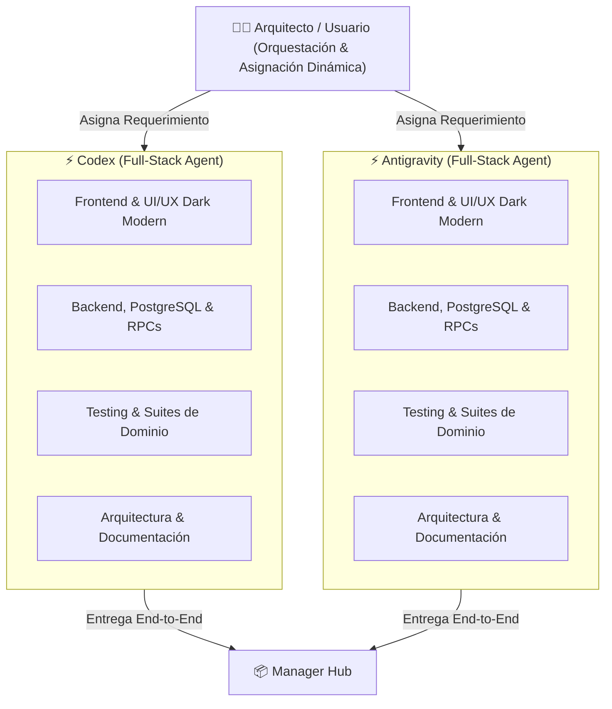

# 🤖 Guía Única de Contexto y Protocolo para Agentes de IA

⚠️ **REGLA OBLIGATORIA PARA CUALQUIER AGENTE DE IA:**
Este proyecto cuenta con DOS (2) fuentes únicas de verdad arquitectónica y de negocio. Ningún agente debe asumir especificaciones ni leer documentación fuera de estos dos archivos maestros:

1. **`PROJECT_CONTEXT_AND_ARCHITECTURE.md`**: Stack técnico, configuración de Vite/React/Tailwind, esquema completo de Supabase/PostgreSQL, RPCs, políticas RLS, primitivas UI Dark Modern y estrategias de resiliencia.
2. **`BUSINESS_RULES_AND_USE_CASES.md`**: Cerebro maestro funcional con todas las reglas de negocio, flujos operativos, catálogo unificado de roles RBAC, validaciones de dominio y ciclo de vida de cada módulo.

> **Nota de Gobernanza:** Cualquier archivo dentro de `.archive_docs/` o notas markdown legacy en desuso deben ser ignoradas.

---

## 1. Modelo Operativo Full-Stack Flexible (Codex & Antigravity)

El desarrollo del proyecto opera bajo un **modelo Full-Stack Generalista y Autónomo**. Ambos agentes (**Codex** y **Antigravity**) poseen capacidades completas e integrales para intervenir en cualquier capa del sistema, desde la interfaz de usuario hasta la persistencia y la arquitectura de datos.



### 1.1 Capacidades Plenas de Ambos Agentes
Tanto **Codex** como **Antigravity** están facultados para ejecutar tareas de extremo a extremo:
- **Frontend & UI/UX**: Desarrollo en React 17/Vite con TypeScript estricto, composición de layouts responsivos, Tailwind CSS con paleta Dark Modern (`slate-900`/`slate-950`, acentos `cyan-500`), kit de primitivas (`components/Common/`), Fluent UI React, microinteracciones y animaciones ergonómicas.
- **Backend & Base de Datos**: Modelado relacional en PostgreSQL, desarrollo y optimización de RPCs (`security definer`), diseño de políticas Row Level Security (RLS), migraciones idempotentes en `supabase/migrations/` e integración de clientes de datos (`CloudDbClient`, `RBACService`, `SharePointService`).
- **Calidad & Testing**: Ejecución y diseño de pruebas unitarias y de componentes con Vitest/JSDOM (`vitest.config.mts`), y suites de dominio con Node test runner (`npm test`).
- **Arquitectura & Documentación**: Sincronización continua de documentos maestros de arquitectura, especificación de reglas de negocio, gobierno RBAC y registro de changelog.

### 1.2 Orquestación y Asignación por el Arquitecto
La asignación de tareas a **Codex** o a **Antigravity** queda a total discreción operativa del Arquitecto del proyecto, permitiendo alternar o paralelizar intervenciones según la necesidad del flujo de trabajo.

---

## 2. Convención Estricta de Ramas de Trabajo

Para mantener una trazabilidad transparente y ordenada, todo desarrollo o ajuste debe realizarse en ramas identificadas con el prefijo del agente activo y el tipo de intervención:

| Agente Activo | Tipo de Tarea | Patrón de Nombre de Rama | Ejemplo |
| :--- | :--- | :--- | :--- |
| **Codex** | Nueva funcionalidad | `feature/codex/<nombre-feature>` | `feature/codex/iniciativas-preview-7-5` |
| **Codex** | Corrección de bug | `fix/codex/<nombre-bug>` | `fix/codex/kpi-card-overflow` |
| **Codex** | Refactorización de código | `refactor/codex/<componente-o-servicio>` | `refactor/codex/faltas-form-primitives` |
| **Codex** | Documentación | `docs/codex/<tema>` | `docs/codex/sync-architecture-context` |
| **Antigravity** | Nueva funcionalidad | `feature/antigravity/<nombre-feature>` | `feature/antigravity/rbac-custom-roles` |
| **Antigravity** | Corrección de bug | `fix/antigravity/<nombre-bug>` | `fix/antigravity/user-roles-cascade-fix` |
| **Antigravity** | Refactorización de código | `refactor/antigravity/<componente-o-servicio>` | `refactor/antigravity/end-to-end-viewmodel` |
| **Antigravity** | Documentación | `docs/antigravity/<tema>` | `docs/antigravity/update-agent-generalist-model` |

---

## 3. Formato de Commits con Firma del Agente

Cada commit debe seguir el estándar de *Conventional Commits* incluyendo obligatoriamente la etiqueta del agente activo entre corchetes para auditar la autoría de cada cambio:

### Estructura del Mensaje:
```
<tipo>(<alcance>): [<agente>] <descripción clara en imperativo/español>
```

### Ejemplos Válidos:
- `feat(ui): [codex] optimizar layout de filtros end-to-end`
- `feat(ui): [antigravity] implementar drawer lateral de auditoria`
- `fix(rbac): [codex] corregir asignacion de rol en user admin`
- `fix(rbac): [antigravity] ajustar politica rls en solicitudes`
- `refactor(common): [codex] migrar modales heredados a primitiva AppDialog accesible`
- `feat(rbac): [antigravity] crear rpc rbac_create_role con validacion de slug`
- `docs(agents): [antigravity] actualizar modelo de agentes a full-stack generalista`

---

## 4. Protocolo de Protección de Base de Datos y Despliegues

⚠️ **MÁXIMA PRIORIDAD DE SEGURIDAD OPERATIVA:**

1. **Prohibición de Migración Directa en Producción:**
   - Ningún agente de IA tiene autorización para aplicar sentencias DDL directas (`CREATE TABLE`, `ALTER TABLE`, `DROP`, `CREATE FUNCTION`) sobre la base de datos de producción mediante clientes automáticos o conexiones interactivas no supervisadas.
2. **Generación de Migraciones Idempotentes y Transaccionales:**
   - Todo cambio en el modelo relacional o en las funciones RPC de PostgreSQL debe crearse como un archivo SQL aislado dentro de `supabase/migrations/` siguiendo la convención de nomenclatura cronológica:
     ```
     supabase/migrations/YYYYMMDDNNNN_<descripcion_corta>.sql
     ```
   - El script debe encapsularse en un bloque transaccional (`begin; ... commit;`), ser idempotente (`if not exists`, `create or replace`, `on conflict do nothing/update`) y otorgar los permisos de ejecución mínimos necesarios a `authenticated` mientras revoca el acceso a `anon`/`public`.
3. **Revisión y Ejecución Manual:**
   - Las migraciones generadas en el repositorio son revisadas y ejecutadas manualmente por el Administrador del Sistema a través del Dashboard de Supabase o la CLI oficial tras validar los planes de prueba.

---

## 5. Directrices Técnicas de Calidad y No Regresión

1. **TypeScript Estricto:** Prohibido el uso de `any` injustificado. Todo nuevo modelo, payload de RPC o contrato de componente debe tiparse rigurosamente en `src/types/` o en el módulo respectivo.
2. **Erradicación de Popups Nativos:** Está terminantemente prohibido utilizar `window.alert()` o `window.confirm()`. Toda confirmación o diálogo debe usar `AppDialog` o `DeleteConfirmModal`.
3. **Cumplimiento Dark Modern:** Erradicación total de fondos claros (`NO bg-white`, `NO text-black`) utilizando las primitivas estandarizadas de la paleta `slate`/`cyan`.
4. **Validación Previa a Finalizar Tareas:**
   - Ejecutar suite de pruebas unitarias (`npm test` / `vitest`).
   - Comprobar ausencia de errores de tipado en TypeScript.
   - Comprobar que ningún archivo fuera del alcance previsto haya sido modificado.
