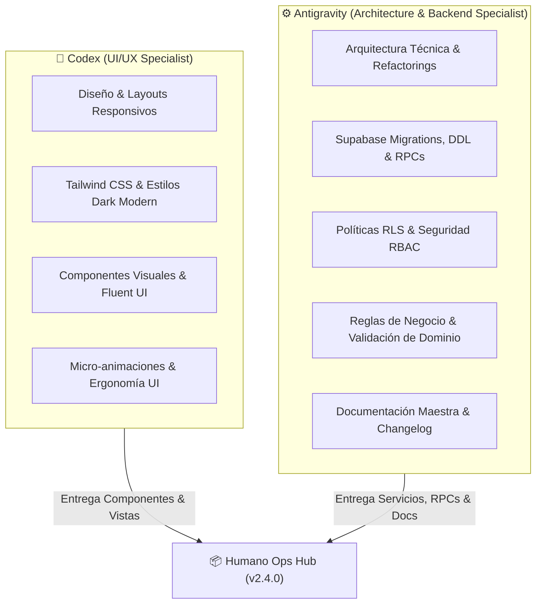

# 🤖 Guía Única de Contexto y Protocolo para Agentes de IA

⚠️ **REGLA OBLIGATORIA PARA CUALQUIER AGENTE DE IA:**
Este proyecto cuenta con DOS (2) fuentes únicas de verdad arquitectónica y de negocio. Ningún agente debe asumir especificaciones ni leer documentación fuera de estos dos archivos maestros:

1. **`PROJECT_CONTEXT_AND_ARCHITECTURE.md`**: Stack técnico, configuración de Vite/React/Tailwind, esquema completo de Supabase/PostgreSQL, RPCs, políticas RLS, primitivas UI Dark Modern y estrategias de resiliencia.
2. **`BUSINESS_RULES_AND_USE_CASES.md`**: Cerebro maestro funcional con todas las reglas de negocio, flujos operativos, catálogo unificado de roles RBAC, validaciones de dominio y ciclo de vida de cada módulo.

> **Nota de Gobernanza:** Cualquier archivo dentro de `.archive_docs/` o notas markdown legacy en desuso deben ser ignoradas.

---

## 1. Modelo de Trabajo Híbrido (Codex & Antigravity)

Para garantizar la máxima velocidad de entrega sin degradar la coherencia arquitectónica ni la calidad estética, el desarrollo del proyecto opera bajo un modelo de colaboración entre dos agentes especializados:



### 1.1 Especialización por Agente
- **Codex**:
  - Enfoque exclusivo en frontend: composición visual, jerarquías de layout, CSS/Tailwind, transiciones, componentes en `src/webparts/supervisionOperaciones/components/` y microinteracciones de interfaz de usuario.
  - Asegura el cumplimiento riguroso de la paleta Dark Modern (`slate-900`/`slate-950`, acentos `cyan-500`, estados semánticos) y la erradicación total de fondos claros (`NO bg-white`).
- **Antigravity**:
  - Enfoque en arquitectura global, integración de servicios de datos (`CloudDbClient`, `RBACService`, `SharePointService`), definición de tipos y contratos TypeScript (`src/types/`, `src/auth/`), funciones SQL/RPC en PostgreSQL, políticas RLS en Supabase, auditoría de código, sincronización de documentación técnica y suites de pruebas unitarias/dominio.

---

## 2. Convención Estricta de Ramas de Trabajo

Todo desarrollo o ajuste debe realizarse en ramas identificadas con el prefijo del agente responsable y el tipo de intervención:

| Agente | Tipo de Tarea | Patrón de Nombre de Rama | Ejemplo |
| :--- | :--- | :--- | :--- |
| **Codex** | Nueva funcionalidad UI | `feature/codex/<nombre-feature>` | `feature/codex/iniciativas-preview-7-5` |
| **Codex** | Corrección visual / CSS | `fix/codex/<nombre-bug>` | `fix/codex/kpi-card-overflow` |
| **Codex** | Refactorización de layout | `refactor/codex/<componente>` | `refactor/codex/faltas-form-primitives` |
| **Antigravity** | Funcionalidad Core / BD | `feature/antigravity/<feature>` | `feature/antigravity/rbac-custom-roles` |
| **Antigravity** | Corrección de lógica / RPC | `fix/antigravity/<nombre-bug>` | `fix/antigravity/user-roles-cascade-fix` |
| **Antigravity** | Sincronización de Docs | `docs/antigravity/<version>` | `docs/antigravity/sync-architecture-context-v2.4` |

---

## 3. Formato de Commits con Firma del Agente

Para mantener una trazabilidad transparente y auditable en el historial de Git, cada commit debe seguir el estándar de *Conventional Commits* incluyendo obligatoriamente la etiqueta del agente activo entre corchetes:

### Estructura del Mensaje:
```
<tipo>(<alcance>): [<agente>] <descripción clara en imperativo/español>
```

### Ejemplos Válidos:
- `feat(mejoras): [codex] implementar layout 7/5 y live preview en iniciativas`
- `feat(rbac): [antigravity] crear rpc rbac_create_role con validacion de slug y bypass admin`
- `fix(ausencias): [codex] alinear selector de periodo anual con dark primitives`
- `fix(end-to-end): [antigravity] aislar resolucion de conflictos por snapshot de usuario`
- `docs(core): [antigravity] sincronizacion integral de arquitectura, rbac y primitivas v2.4.0`
- `refactor(common): [codex] migrar modales heredados a primitiva AppDialog accesible`

---

## 4. Protocolo de Protección de Base de Datos y Despliegues

⚠️ **MÁXIMA PRIORIDAD DE SEGURIDAD OPERATIVA:**

1. **Prohibición de Migración Directa en Producción:**
   - Ningún agente de IA tiene autorización para aplicar sentencias DDL directas (`CREATE TABLE`, `ALTER TABLE`, `DROP`, `CREATE FUNCTION`) sobre la base de datos de producción mediante clientes automáticos o conexiones interactivas no supervisadas.
2. **Generación de Migraciones Idempotentes y Transaccionales:**
   - Todo cambio en el modelo relacional o en las funciones RPC de PostgreSQL debe crearse como un archivo SQL aislado dentro de `supabase/migrations/` siguiendo la convención de nomenclatura cronológica:
     ```
     supabase/migrations/YYYYMMDDNNNN_<descripcion_corta>.sql
     ```
   - El script debe encapsularse en un bloque transaccional (`begin; ... commit;`), ser idempotente (`if not exists`, `create or replace`, `on conflict do nothing/update`) y otorgar los permisos de ejecución mínimos necesarios a `authenticated` mientras revoca el acceso a `anon`/`public`.
3. **Revisión y Ejecución Manual:**
   - Las migraciones generadas en el repositorio son revisadas y ejecutadas manualmente por el Administrador del Sistema a través del Dashboard de Supabase o la CLI oficial tras validar los planes de prueba.

---

## 5. Directrices Técnicas de Calidad y No Regresión

1. **TypeScript Estricto:** Prohibido el uso de `any` injustificado. Todo nuevo modelo, payload de RPC o contrato de componente debe tiparse rigurosamente en `src/types/` o en el módulo respectivo.
2. **Erradicación de Popups Nativos:** Está terminantemente prohibido utilizar `window.alert()` o `window.confirm()`. Toda confirmación o diálogo debe usar `AppDialog` o `DeleteConfirmModal`.
3. **Validación Previa a Finalizar Tareas:**
   - Ejecutar suite de pruebas unitarias (`npm test` / `vitest`).
   - Comprobar ausencia de errores de tipado en TypeScript.
   - Comprobar que ningún archivo fuera del alcance previsto haya sido modificado.
