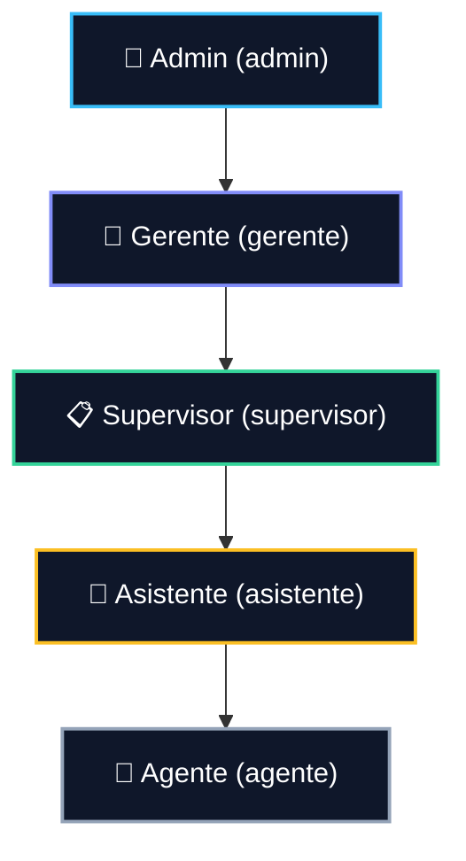
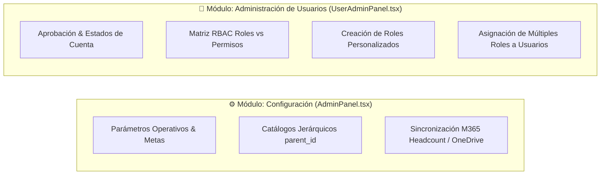
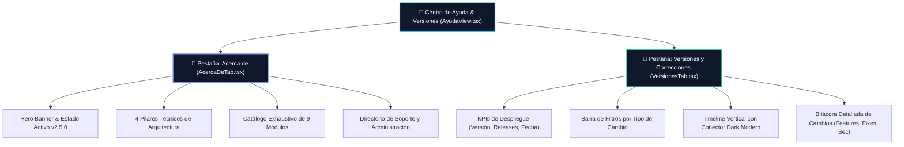

# Business Rules and Functional Specification: Humano Ops Hub (Cerebro Maestro)

Este documento constituye la especificación funcional completa, exhaustiva y fuente única de verdad sobre las reglas de negocio, flujos operativos, políticas de dominio y catálogo de roles/permisos implementados en la plataforma **Humano Ops Hub (v2.5.0)**.

---

## 1. Matriz de Autorización, Catálogo Unificado de 5 Roles y RBAC

### 1.1 Catálogo Unificado de Roles Base
La seguridad y el control de acceso en Humano Ops Hub operan bajo un modelo RBAC (*Role-Based Access Control*) desacoplado de cadenas de texto rígidas y respaldado por PostgreSQL en Supabase. El sistema define una jerarquía operativa estructurada en **5 roles base canónicos**:



#### Descripción Detallada de Facultades por Rol:
1. **Admin (Slug: `admin`)**:
   - **Nivel**: Administrador General de la Plataforma.
   - **Facultades**: Control técnico integral de la plataforma; administración de catálogos y parámetros del sistema; gestión completa de identidades de usuario (aprobación, activación, deshabilitación); configuración de la matriz RBAC (permisos por rol y asignación de múltiples roles a usuarios); creación de roles personalizados; eliminación de registros críticos en productividad, faltas e iniciativas; y visualización transversal sin restricciones.
   - **Superrol Inmutable**: Cuenta con **Bypass Total y Definitivo**. Cualquier validación de permisos en frontend (`hasPermission`, `hasAnyPermission`) o backend (`rbac_has_permission()`, `rbac_is_admin()`) retorna `true` de forma inmediata para este rol, garantizando la continuidad operativa.
2. **Gerente (Slug: `gerente`)**:
   - **Nivel**: Gestión Ejecutiva y Dirección de Operaciones.
   - **Facultades**: Visibilidad transversal de todos los tableros analíticos (Dashboard General, Evaluación de Rendimiento, Historial de Productividad, Ausencias, Kudos y Operaciones End-to-End); aprobación de faltas/errores de alto impacto; y revisión/aprobación de Historias de Usuario en Iniciativas & Mejoras. No posee facultades para modificar matrices RBAC ni alterar catálogos de infraestructura.
3. **Supervisor (Slug: `supervisor`)**:
   - **Nivel**: Supervisión Operativa Directa y Líder de Equipo.
   - **Facultades**: Registro y aprobación de faltas y amonestaciones; registro de tiempos de ocupación (llamadas/correos); registro y seguimiento de productividad diaria; gestión y aprobación de ausencias y planificación semanal; publicación del reconocimiento *Empleado del Mes*; aprobación/descarte de solicitudes de mejora continua; e importación, validación, exclusión auditada y resolución de conflictos en el ciclo End-to-End.
4. **Asistente (Slug: `asistente`)**:
   - **Nivel**: Apoyo Operativo, Reportería y Custodia de Radicaciones (Consolidación de roles históricos *Custodio* y *Analista*).
   - **Facultades**: Consulta de tableros de productividad; registro de incidencias disciplinarias (ingresan en estado `Pendiente`); solicitud de ausencias y vacaciones; envío de Kudos; creación y edición de iniciativas propias; e importación, custodia, marcado de radicaciones reportadas y exclusión auditada en el módulo End-to-End.
5. **Agente (Slug: `agente`)**:
   - **Nivel**: Operador Base y Colaborador de Línea (Consolidación de roles históricos *Colaborador* y *Oficial*).
   - **Facultades**: Consulta de indicadores personales en dashboard; registro de faltas o incidencias personales; solicitud de ausencias y vacaciones propias; envío de Kudos a compañeros; y registro, edición y seguimiento de sus propias Historias de Usuario en el módulo de Iniciativas & Mejoras.

### 1.2 Mapeo Canónico de Roles Legacy
Para garantizar la compatibilidad retroactiva durante migraciones o sincronizaciones de directorio M365, todo rol heredado se normaliza automáticamente a su slug canónico mediante `canonicalizeRoleSlug()` y triggers de base de datos:

| Rol Legacy / Alias | Slug Canónico Normalizado | Nombre Mostrado |
| :--- | :--- | :--- |
| `Master_Admin`, `Master Admin`, `master-admin`, `admin` | `admin` | Admin |
| `Gerente`, `gerente` | `gerente` | Gerente |
| `Supervisor`, `supervisor` | `supervisor` | Supervisor |
| `Custodio`, `Analista`, `Asistente`, `custodio`, `analista` | `asistente` | Asistente |
| `Colaborador`, `Oficial`, `Agente`, `colaborador`, `oficial` | `agente` | Agente |

### 1.3 Creación Dinámica de Roles Personalizados
- Los administradores autorizados con el permiso `modulo:admin:gestionar_permisos` pueden dar de alta nuevos roles personalizados (`is_system = false`) directamente desde la interfaz de usuario a través del RPC `rbac_create_role(target_role_id, target_name, target_description)`.
- **Reglas de Validación de Roles Personalizados**:
  1. El slug identificador debe comenzar con una letra y contener únicamente minúsculas, números o guiones bajos (`^[a-z][a-z0-9_]{2,49}$`).
  2. Queda prohibido reutilizar identificadores reservados (`admin`, `gerente`, `supervisor`, `asistente`, `agente`, `master_admin`, `custodio`, `analista`, `colaborador`, `oficial`).
  3. El nombre descriptivo debe contener entre 3 y 80 caracteres.
  4. Los roles personalizados se integran de inmediato a la matriz RBAC para asignación de permisos y vinculación a usuarios.

### 1.4 Asignación Múltiple Acumulativa y Protección del Último Admin
- **Múltiples Roles por Usuario**: La relación entre usuarios y roles (`user_roles`) es de muchos a muchos. Un colaborador puede tener asignados múltiples roles (ej: `supervisor` + rol personalizado de `auditor_calidad`), sumando el conjunto acumulado de permisos efectivos.
- **Protección del Último Administrador**: La función `rbac_set_user_roles` valida en base de datos que la operación no despoje del rol `admin` al único administrador activo en la plataforma (`errcode = '23514'`), evitando bloqueos accidentales.
- **Principio de Denegación por Defecto (*Deny-by-Default*)**: Mientras la sesión se inicializa, o si ocurre una falla de red con Supabase, la política de seguridad asume ausencia total de permisos, bloqueando acciones protegidas hasta verificar el acceso efectivo.

---

## 2. Separación Funcional: "Configuración" vs "Administración de Usuarios"

Para mantener la cohesión operativa y la segregación de funciones, la plataforma divide el área administrativa en dos módulos claramente delimitados:



### 2.1 Módulo "Configuración" (`AdminPanel.tsx` / `CatalogosAdmin.tsx`)
- **Responsabilidad Principal**: Gestión de variables globales, parámetros de cálculo y catálogos maestros del sistema.
- **Permisos Asociados**: `modulo:admin:ver`, `modulo:admin:gestionar_catalogos`, `modulo:admin:eliminar_catalogos`.
- **Funcionalidades**:
  1. **Catálogos Jerárquicos Dinámicos**: Mantenimiento de opciones para `Falta`, `ErrorProceso`, `CodigoEtica`, `Kudo`, `ProcesoArea`, `aplicativos`, `modulos` y `pantallas`.
     - *Regla de Jerarquía*: Al registrar un Módulo, se exige seleccionar su Aplicativo Padre (`parent_id`). Al registrar una Pantalla, se exige seleccionar su Módulo Padre (`parent_id`).
  2. **Parámetros y Metas Operativas**: Configuración de metas diarias, ponderaciones de evaluación y ponderadores SLA (`configuraciones_sistema`, `metas`).
  3. **Sincronización de Directorio / Headcount M365**: Ejecución y monitoreo de la sincronización de colaboradores desde listas de SharePoint / OneDrive mediante flujos de Power Automate (`PowerAutomateSyncService.ts`).
  4. **Prohibición de Datos Ficticios (*No Mock Data*)**: Si un catálogo carece de datos, los selectores despliegan el mensaje de estado `"Sin opciones disponibles (Configurar en Configuración)"`.

### 2.2 Módulo "Administración de Usuarios" (`UserAdminPanel.tsx` / `RolesPermissionsAdmin.tsx`)
- **Responsabilidad Principal**: Gobierno de identidades, perfiles, asignación de roles y control granular de la matriz de permisos.
- **Permisos Asociados**: `modulo:admin:gestionar_usuarios`, `modulo:admin:gestionar_permisos`.
- **Funcionalidades**:
  1. **Gestión del Ciclo de Vida de Cuentas**: Aprobación de registros pendientes (`Pending_Admin_Approval`), activación (`Active`) o deshabilitación (`Disabled`) de usuarios.
  2. **Centro de Matriz RBAC (`RolesPermissionsAdmin.tsx`)**:
     - Visualización y edición en tiempo real de permisos agrupados por módulo.
     - Asignación de permisos a roles canónicos y personalizados mediante `rbac_set_role_permissions`.
     - Modal accesible para la creación de nuevos roles dinámicos mediante `rbac_create_role`.
     - Asignación y persistencia de múltiples roles por usuario mediante `rbac_set_user_roles`.

---

## 3. Módulo "Iniciativas & Mejoras" (Historias de Usuario v2.4.0)

El módulo de Iniciativas (`IniciativasMejorasView.tsx` / `improvementsDomain.ts`) proporciona un entorno integral para la captura, revisión y exportación de mejoras continuas bajo estándares ágiles (*User Stories*).

### 3.1 Estructura Obligatoria de Historia de Usuario (*Como / Quiero / Para*)
La captura de historias erradica los campos de texto no estructurados e impone la plantilla estándar con badges visuales distintivos:
- 👤 **Como...** (Badge Azul / `actor`): Especifica el rol o perfil del usuario beneficiario (ej: *"Como Supervisor de Operaciones"*).
- ✨ **Quiero...** (Badge Índigo / `necesidad`): Describe la acción, comportamiento o funcionalidad requerida (ej: *"Quiero filtrar los reportes de productividad por rango semanal"*).
- 🎯 **Para...** (Badge Púrpura / `beneficio`): Expresa el valor de negocio o impacto esperado (ej: *"Para reducir el tiempo de auditoría de 30 a 5 minutos"*).

La narrativa combinada se autogenera mediante:
```
Como [actor], quiero [necesidad], para [beneficio].
```

### 3.2 Criterios de Aceptación Dinámicos (Gherkin & Checklist)
El editor soporta dos modalidades de criterios de aceptación conmutables mediante pestañas:
1. **Modo Checklist**: Texto directo con casillas de verificación para marcar avances o completitud (`verified: boolean`).
2. **Modo Gherkin**: Estructura formal *Dado [contexto], cuando [acción], entonces [resultado]* distribuida en tres campos amplios al 100% del ancho del contenedor.

### 3.3 Layout Ergonómico 7/5 y Live Preview
- **Disposición en Pantallas Grandes (Grid 12 columnas)**:
  - **Columna Izquierda (7 columnas)**: Formulario del editor estructurado (Título, Selectores de Módulo/Prioridad/Estado, Bloque Como/Quiero/Para, y Gestor de Criterios de Aceptación).
  - **Columna Derecha (5 columnas)**: Tarjeta de *Live Preview* fijada en modo `sticky`, renderizando en tiempo real la Historia de Usuario final con sus etiquetas de prioridad, estado, módulo, narrativa estructurada y checklist interactivo.
- **Disposición en Dispositivos Móviles**: Apilamiento vertical fluido priorizando el ingreso de datos y visualización posterior de la vista previa.

### 3.4 Estados del Ciclo de Vida y Reglas de Transición
| Estado (`estado_ciclo`) | Descripción | Regla de Validación |
| :--- | :--- | :--- |
| **Borrador** | Idea preliminar guardada por el autor | Permite guardado incompleto (solo requiere título). |
| **En Revision** | Enviada formalmente para evaluación | Requiere título, los 3 campos Como/Quiero/Para y al menos 1 criterio completo. |
| **Aprobada** | Validada favorablemente por supervisor/gerente | Requiere revisión formal con comentario >= 10 caracteres. |
| **En Desarrollo** | En proceso de construcción técnica | Asignada al roadmap de desarrollo. |
| **Implementada** | Desplegada exitosamente en producción | Cierre exitoso del ciclo de vida. |
| **Descartada** | Declinada justificadamente por el revisor | Requiere motivo y feedback >= 10 caracteres. |

### 3.5 Flujo de Revisión y Modal de Retroalimentación Obligatoria
- Los usuarios con permiso `modulo:iniciativas:aprobar` (Supervisores, Gerentes y Admin) pueden evaluar historias en estado `En Revision`.
- **Regla del Comentario Obligatorio**: Al Aprobar o Descartar una solicitud, se despliega un modal accesible (`AppDialog`). El botón de confirmación se mantiene **deshabilitado hasta que el revisor ingrese al menos 10 caracteres de justificación/retroalimentación**.
- La persistencia se ejecuta a través del RPC seguro `iniciativas_review(target_id, target_status, review_comment, reviewer_email, reviewer_name)`.

### 3.6 Exportación Multiformato para Azure DevOps / Jira
El módulo ofrece copiado al portapapeles con un solo clic en tres formatos estandarizados:
1. **Markdown**: Formato estructurado con encabezados, metadatos en negrita y checkboxes `- [x]` / `- [ ]` listo para incidencias de GitHub/GitLab o wikis corporativas.
2. **HTML Limpio**: Marcado semántico estructurado (`<article>`, `<h1>`, `<p>`, `<ul>`, `<li>`) diseñado para pegado directo en campos de descripción enriquecida en **Azure DevOps** o **Jira**.
3. **TSV (Tab-Separated Values)**: Estructura tabular copiable para importación masiva en Microsoft Excel o Google Sheets.

---

## 4. Módulo de Productividad Operativa

### 4.1 Líneas de Proceso y Métricas
El registro diario de productividad (`ProductividadForm.tsx`) captura las siguientes líneas operativas:
1. **Casos Atendidos / SLA**: Total de casos atendidos y casos atendidos dentro del tiempo de SLA.
2. **Emisiones**: Transacciones (`emisiones_tx`), Procesados (`emisiones_pg`) y Devoluciones (`devoluciones_emisiones`).
3. **Movimientos**: Transacciones (`movimientos_tx`), Procesados (`movimientos_pg`) y Devoluciones (`devoluciones_movimientos`).
4. **Escaneo**: Transacciones (`escaneo_tx`), Procesados (`escaneo_pg`) y Devoluciones (`devoluciones_escaneo`).
5. **Gestión de Carnets**: Transacciones (`carnets_tx`) y Procesados (`carnets_pg`).

### 4.2 Regla de Devoluciones Condicionales
- El campo de **Devoluciones** es visible y requerido **EXCLUSIVAMENTE** para los procesos de **Emisiones**, **Movimientos** y **Escaneo**.
- En las demás líneas (Casos Atendidos, Gestión de Carnets), el campo se oculta completamente para evitar inconsistencias estadísticas.

### 4.3 Bloqueo Estricto de Períodos en Curso (Día Actual y Futuro)
- **Política de Registro**: Solo se permite registrar productividad correspondiente a jornadas operativas concluidas.
- **Validación**: La fecha seleccionada debe ser estrictamente anterior a la fecha actual (`fecha < fechaActualSinHora`). Si se selecciona la fecha de hoy o una fecha futura, el formulario bloquea el envío y muestra advertencia.

### 4.4 Eliminación Segura y Auditada
- La eliminación de registros en la lista de productividad requiere el permiso `modulo:productividad:eliminar` o pertenecer al rol `admin`.
- Toda eliminación exige confirmación explícita mediante el modal modal oscuro `DeleteConfirmModal` identificando el registro por su UUID / `audit_id`.

---

## 5. Módulo de Faltas y Errores Operativos

### 5.1 Tipificación y Categorización
- **Falta Disciplinaria**: Tardanzas en minutos, inasistencias injustificadas, incumplimientos de horario.
- **Error de Proceso**: Errores en captura o digitación, reprocesos operativos, omisión de políticas de verificación.
- **Código de Ética**: Violación de confidencialidad, uso indebido de herramientas, faltas a normas corporativas.

### 5.2 Parámetros de Auditoría y Aprobación Automática
- **Campos Requeridos**: Impacto (Bajo, Medio, Alto, Crítico), Horas Perdidas (`horas_perdidas`), Minutos de Tardanza (`minutos_tardanza`), Hora de Llegada (`hora_llegada`), Ticket de Referencia (`id_caso_helpdesk`), Proceso del Área (`proceso_area`), Comentarios y Plan de Acción / Capacitación (`comentarios_capacitacion`).
- **Aprobación Automática**:
  - Registros creados por usuarios con rol `Supervisor`, `Gerente` o `Admin` quedan en estado `Aprobado` automáticamente.
  - Registros ingresados por usuarios con rol `Asistente` o `Agente` ingresan en estado `Pendiente` a la espera de validación por su supervisor.

### 5.3 Aprobación Masiva en Lote (*Batch Approvals*)
- **Bandeja de Aprobaciones (`AprobacionesView.tsx`)**:
  - Los supervisores y gerentes disponen de casillas de selección individual por fila y una casilla maestra en el encabezado para seleccionar todos los registros pendientes visibles en la tabla.
  - Al seleccionar uno (1) o más registros, emerge una **Barra Flotante de Acciones en Lote** fijada en la parte inferior (`fixed bottom-6 right-8 z-40`).
  - La barra muestra el conteo dinámico de elementos seleccionados, un botón para deseleccionar y el botón de acción principal *"Aprobar Seleccionadas"*.
  - **Confirmación Transaccional Accesible**: Al pulsar el botón de aprobación masiva, se despliega un diálogo `AppDialog` modal que detalla la cantidad exacta de incidencias a aprobar.
  - **Ejecución y Resiliencia**: El procesamiento se ejecuta en lote actualizando el estado a `Aprobado` en Supabase/IndexedDB, emite una notificación toast de éxito y refresca la bandeja operativa sin recargas de página ni parpadeos de interfaz.

---

## 6. Módulo de Reconocimientos, Kudos y Empleado del Mes

### 6.1 Envío de Kudos
- Reconocimiento entre compañeros basado en atributos culturales definidos en catálogos (Trabajo en Equipo, Orientación al Cliente, Innovación, Excelencia Operativa).
- Asignación de puntaje y dedicatoria personalizada, registrando el correo del remitente para auditoría.

### 6.2 Publicación y Beneficio de Día Libre (Empleado del Mes)
- Al publicar el galardón mensual en `empleado_del_mes`, el registro se inicializa con `dia_libre_reclamado = false`.
- **Canje Obligatorio en Ausencias**:
  - Al solicitar una ausencia de tipo *"Día Libre Empleado del Mes"* en `AusenciasForm.tsx`, el sistema consulta los registros de premiación pendientes de canje para ese colaborador.
  - El usuario debe seleccionar obligatoriamente el período del premio a canjear.
  - Al persistir la ausencia, el sistema actualiza de inmediato el premio a `dia_libre_reclamado = true` y almacena la referencia cruzada `premio_empleado_mes_id`.

---

## 7. Módulo de Ausencias, Vacaciones y Planificación Semanal

### 7.1 Tipos de Ausencia y Regla de Período Anual
- Tipos soportados: `Vacaciones`, `Día Libre Cumpleaños`, `Día Libre Empleado del Mes`, `Licencia / Incapacidad`.
- **Selector de Período en Vacaciones**: Al seleccionar *"Vacaciones"*, se habilita el selector del **Año del Período Reclamado** (`periodo_anio`, ej: 2024, 2025, 2026) para imputar correctamente el balance de días pendientes del colaborador.

### 7.2 Matriz de Planificación Semanal, Capacidad Neta y Heatmap Semántico
- El componente `PlanificacionSemanal.tsx` consolida la matriz de asistencia por turno y día de la semana.
- **Deducción Dinámica de Capacidad**: La capacidad operativa neta descuenta automáticamente a los colaboradores que registran ausencias aprobadas en Supabase dentro de la ventana semanal visualizada.
- **Heatmap Semántico de Cobertura Diaria**: El pie de tabla (`<tfoot>`) calcula en tiempo real el porcentaje de capacidad operativa neta vs capacidad teórica para cada día y aplica una escala cromática de alerta temprana:
  * 🟢 **Capacidad Óptima (≥ 90%)**: Verde esmeralda (`text-emerald-400 bg-emerald-500/10`) indicando cobertura operativa saludable.
  * 🟡 **Alerta de Capacidad (75% – 89%)**: Amarillo ámbar (`text-amber-400 bg-amber-500/10`) indicando necesidad de monitoreo por baja de turno.
  * 🔴 **Déficit Crítico de Capacidad (< 75%)**: Rojo rosa (`text-rose-400 bg-rose-500/10 font-bold`) alertando riesgo inminente de incumplimiento de SLA.

---

## 8. Módulo Operativo End-to-End (Radicaciones y SLA)

### 8.1 Aislamiento de Fotografías Operativas (*User Isolation*)
- Cada analista o custodio que importa un reporte de radicaciones genera una fotografía independiente identificada por su `owner_id` / `user_id`.
- Las consultas operativas aíslan las sesiones para evitar que la carga de un analista sobreescriba las radicaciones activas de otro usuario.

### 8.2 Métricas de SLA y Conciliación
- Cálculo automático de cumplimiento de SLA en base a la fecha de radicación, tipo de trámite y calendario operativo.
- Registro de feriados y días inhábiles en `end_to_end_calendars`.

### 8.3 Exclusión Auditada y Resolución de Conflictos
- **Exclusión de Filas Críticas**: Permite excluir radicaciones anómalas exigiendo motivo justificado y registrando autor y marca de tiempo en `end_to_end_audit_log`.
- **Marcado de Reportadas**: Los custodios y supervisores pueden alternar el flag de radicaciones ya reportadas a entes de control.
- **Resolución de Conflictos**: Mecanismo de resolución para fotografías cargadas con la misma fecha de corte.
- **Portal de Copiado de Columnas**: Herramienta integrada (`CopyColumnsPortal.tsx`) para copiar subconjuntos tabulares directamente a hojas de trabajo.

### 8.4 Selector de Densidad de Datos Tabulares
- **Densidad Conmutable**: Permite alternar entre visualización **Cómoda** (`comfortable`) y **Compacta** (`compact`) en la barra de herramientas de la tabla de radicaciones.
- **Vista Compacta**: Condensa el espaciado vertical a `py-1.5` y tipografía a `text-xs`, maximizando la cantidad de registros evaluables en pantallas de análisis intensivo (lotes de 500+ registros).
- **Persistencia por Usuario**: La preferencia seleccionada se almacena automáticamente en `localStorage('ops_table_density')`, preservando la densidad entre sesiones.

---

## 9. Módulo de Evaluación de Rendimiento

- Consolida de manera ponderada los resultados de productividad diaria, índice de calidad (deducción por faltas y errores de proceso) y cumplimiento de tiempos de ocupación y SLA.
- Genera el reporte consolidado de desempeño individual y por equipo para soporte de revisiones gerenciales.

---

## 10. Módulo "Centro de Ayuda & Versiones" (`AyudaView.tsx`)

El módulo de Ayuda centraliza la documentación interactiva, arquitectura técnica, catálogo de módulos operativos y bitácora histórica de versiones (*Changelog*) del ecosistema **Humano Ops Hub**.



### 10.1 Regla de Acceso Universal y Gobernanza
- **Acceso Irrestricto**: A diferencia de los módulos operativos con permisos granulares, el **Centro de Ayuda** posee acceso universal e irrestricto para todos los usuarios corporativos autenticados (`admin`, `gerente`, `supervisor`, `asistente`, `agente`) sin bloqueos de `PermissionGuard` (`canAccessModule('ayuda') === true`).
- **Navegación**: Accesible desde el ícono `Help` en la sección inferior de la barra de navegación lateral (`SidebarNav.tsx`).

### 10.2 Casos de Uso: Pestaña "Acerca de la Plataforma" (`AcercaDeTab.tsx`)
1. **Visión del Ecosistema e Infraestructura**: Presentación del alcance del hub operativo, entorno de despliegue y compatibilidad con persistencia híbrida (Supabase PostgreSQL y caché local IndexedDB v3).
2. **Pilares Técnicos y Arquitectura**: Detalle interactivo de las bases de ingeniería:
   - *Local-First & Cloud Sync*: Operatividad continua ante fallas de red con sincronización automática.
   - *Seguridad RBAC Granular*: 5 roles canónicos, roles dinámicos y superrol Admin con bypass inmutable.
   - *Design System Dark Modern*: Paleta ergonómica Slate/Cyan, componentes accesibles con Focus Trap y transparencias glassmorphic.
   - *Resiliencia en 3 Capas*: Protección integral respaldada por Git DDL, Supabase PITR y SharePoint/M365.
3. **Catálogo de Módulos Operativos**: Tarjetas `SurfaceCard` para cada uno de los 9 módulos funcionales, detallando:
   - Ícono temático y categoría funcional (*Analítica 360°*, *Radicaciones & SLA*, *Calidad & Disciplina*, *Ágil & DevOps*, etc.).
   - Descripción del propósito operativo.
   - Viñetas de 2 a 3 casos de uso clave.
   - Etiquetas de roles con acceso autorizado (`StatusBadge`).
4. **Directorio y Canales de Contacto**: Acceso directo para escalar consultas operativas a soporte técnico (`soporte.operaciones@humano.com.do`) o gestionar nuevos catálogos con la administración de la plataforma (`admin.ops@humano.com.do`).

### 10.3 Casos de Uso: Pestaña "Versiones y Correcciones" (`VersionesTab.tsx`)
1. **Métricas de Entrega Continua**: Indicadores `KpiCard` destacando la Versión Activa en producción (`v2.5.0`), el total de versiones desplegadas (6 releases históricos) y la fecha de última actualización.
2. **Filtrado Semántico de Novedades**: Barra interactiva de botones estilo píldora que permite aislar los cambios del historial según su naturaleza:
   - 📋 **Todos**: Vista integral de todos los cambios registrados.
   - ✨ **Mejoras / Features**: Nuevas capacidades funcionales y herramientas incorporadas.
   - 🐛 **Correcciones / Bugfixes**: Ajustes de estabilidad, parches y correcciones de cálculos.
   - ⚙️ **Arquitectura / Refactors**: Optimizaciones estructurales, migraciones de base de datos y modernización de código.
   - 🛡️ **Seguridad & RBAC**: Políticas de control de acceso, auditoría y aislamiento de datos.
3. **Línea de Tiempo Vertical (Timeline)**:
   - Conector gráfico Dark Modern con indicador luminoso animado para la versión activa en curso.
   - Tarjetas de versión con codename, fecha de publicación, resumen ejecutivo y lista detallada de cambios con badges semánticos de color (`emerald`, `rose`, `cyan`, `amber`).
   - Enlace directo de referencia técnica al archivo `CHANGELOG.md` del repositorio.

---

## 11. Suite Global de Aceleradores de Productividad y Ergonomía (v2.5.0)

### 11.1 Command Palette Global (`Cmd + K` / `Ctrl + K`)
- **Objetivo**: Proveer una interfaz conversacional y de búsqueda unificada para navegar e interactuar con cualquier sección del hub en menos de 1 segundo sin tocar el ratón.
- **Atajos Globales Reconocidos**:
  * `Cmd + K` (macOS) o `Ctrl + K` (Windows/Linux): Abre o cierra la paleta desde cualquier vista o modal.
  * `Flecha Arriba` / `Flecha Abajo`: Navegación vertical fluida entre resultados filtrados.
  * `Enter`: Ejecución inmediata del comando seleccionado y cierre de la paleta.
  * `Escape`: Cierre instantáneo y retorno del foco al elemento interactivo previo.
- **Catálogo de Comandos Integrados**:
  * **Navegación**: Enlaces directos a los 9 módulos (Dashboard, End-to-End, Faltas, Productividad, Kudos, Mejoras, Ocupación, Evaluación, Administración, Ayuda).
  * **Acciones Rápidas**: Creación de Historias de Usuario, apertura de Planificación Semanal, consulta del Changelog.
  * **Herramientas de Desarrollo**: Conmutación de roles simulados (`admin`, `gerente`, `supervisor`, `asistente`, `agente`) en entorno DEV.

### 11.2 Sistema de Notificaciones Flotantes Apilables (`ToastProvider` & `useToast`)
- **Objetivo**: Notificar resultados operativos (éxito en guardado, advertencias de validación, confirmaciones en lote) mediante una capa flotante no intrusiva que previene desplazamientos indeseados de la interfaz (*Zero Layout Shift*).
- **Variantes y Comportamiento**:
  * **Éxito (`success`)**: Borde y barra esmeralda (`#34d399`), ícono de verificación.
  * **Error (`error`)**: Borde y barra rosa (`#fb7185`), ícono de alerta crítica.
  * **Advertencia (`warning`)**: Borde y barra ámbar (`#fbbf24`), ícono de precaución.
  * **Información (`info`)**: Borde y barra cian (`#22d3ee`), ícono de información.
- **Descarte**: Desaparición automática tras 4 segundos con animación de salida suave o cierre inmediato al pulsar el botón `X`.

