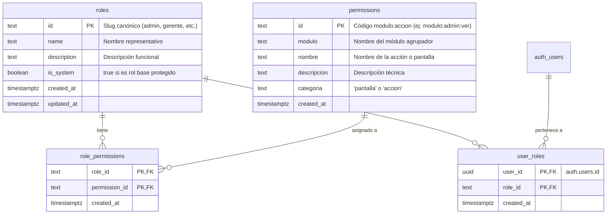
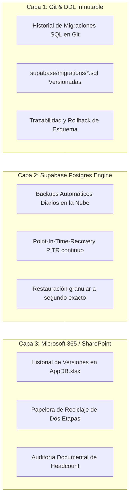

# Project Context and Technical Architecture: Manager Hub

Este documento constituye la fuente oficial y exhaustiva de arquitectura técnica, mapa de módulos, catálogo de primitivas de diseño, especificación de base de datos y estrategias de resiliencia del portal de operaciones **Manager Hub (v2.5.3)**.

---

## 1. Visión General e Infraestructura

### 1.1 Resumen del Sistema
**Manager Hub** es una plataforma web corporativa de gestión operativa, control disciplinario y analítica avanzada de rendimiento diseñada para equipos de operaciones, supervisores, gerentes y analistas. El sistema centraliza:
- Control y registro diario de productividad operativa con validación de devoluciones condicionales.
- Registro, amonestación y tipificación de faltas disciplinarias y errores de proceso con aprobación jerárquica y masiva.
- Medición de tiempos de ocupación (llamadas telefónicas y gestión de correos).
- Sistema de reconocimientos corporativos (*Kudos*) con tope mensual configurable por atributo (`maxKudosPorAtributoMensual`), modal interactivo de la Matriz de Criterios y Conductas (`KudoMatrixModal`) y gestión de galardones (*Empleado del Mes*) con control de días libres.
- Registro de ausencias, licencias e incapacidades, asignación de vacaciones por período anual y cálculo dinámico de capacidad en la matriz de planificación semanal con heatmap semántico.
- Gestión ágil de iniciativas y mejoras continuas estructuradas en Historias de Usuario (*Como / Quiero / Para*) con Live Preview y exportación multiformato para Azure DevOps / Jira.
- Módulo operativo End-to-End con aislamiento de snapshots por analista, conciliación de SLA, selector de densidad y resolución de conflictos.
- Suite global de aceleradores: Command Palette (`Cmd+K`), Sistema de Toasts flotantes y selector de densidad de datos.
- Enrutamiento sincronizado basado en hash (`#/<modulo>`) con persistencia total en recargas (F5), deep linking y sincronización con el historial del navegador.
- Administración y gobierno de identidades mediante una matriz RBAC nativa de 5 roles base y soporte para roles personalizados.

### 1.2 Stack Tecnológico
- **Frontend Core**: React 17.0.1 (Single Page Application).
- **Lenguaje**: TypeScript 5.8 (~5.8.0) con verificación estricta (`tsconfig.app.json`).
- **Bundler & Dev Server**: Vite 8.2.0 (`vite.config.mts`).
- **Sistema de UI / Primitivas**: Kit personalizado de Primitivas Dark Modern (`AppDialog`, `PageHeader`, `KpiCard`, `StatusBadge`, `SurfaceCard`, `EmptyState`, `ToastProvider`, `DataDensityToggle`, `CommandPalette`) complementado con Fluent UI React (`@fluentui/react` ^8.106.4).
- **Estilos & Diseño**: Tailwind CSS v3 (`tailwind.config.js` con `darkMode: 'class'`), Sass (`sass` ^1.102.0) y CSS Modules (`*.module.scss`).
- **Iconografía**: Lucide React (`lucide-react` ^1.16.0) + Fluent UI Icons (`initializeIcons`).
- **Persistencia de Datos**:
  - **Nube (Producción)**: Supabase / PostgreSQL con `@supabase/supabase-js` (^2.112.0).
  - **Caché Local / Offline Fallback**: IndexedDB personalizado (`IndexedDbAdapter.ts` - *HumanoOpsHubDB v3*).
- **Librerías de Soporte**:
  - `exceljs` (^4.4.0): Procesamiento y exportación de reportes analíticos (`AppDB.xlsx`).
  - `jszip` (^3.10.1): Compresión y empaquetado de reportes exportables.
- **Testing**: Vitest (`vitest.config.mts`) y Node Test Runner para pruebas unitarias y de dominio.

### 1.3 Entorno de Ejecución y Scripts de Construcción
El proyecto se ejecuta en un entorno Linux con **Node.js (>=22.14.0 < 23.0.0)**.

#### Comandos de Construcción y Verificación:
```bash
# Instalación de dependencias
npm install

# Servidor de desarrollo local Vite
npm run dev

# Ejecución de pruebas unitarias
npm test

# Compilación de producción (TypeScript strict check + Vite bundle)
npm run build

# Previsualización del bundle de producción
npm run preview

# Generación de base de datos Excel
npm run generate:appdb
```

---

## 2. Estructura de Directorios y Organización del Código

```
/home/edison-ventalm/supervision-app-new
├── index.html                               # Entrypoint HTML de la aplicación
├── package.json                             # Dependencias, scripts y configuración de motor Node
├── tailwind.config.js                       # Configuración de Tailwind CSS con paleta Slate/Cyan
├── tsconfig.app.json                        # Configuración estricta de TypeScript
├── vite.config.mts                          # Configuración del empaquetador Vite
├── vitest.config.mts                        # Configuración de pruebas unitarias Vitest
├── AGENTS.md                                # Protocolo y guía única para agentes de IA
├── BUSINESS_RULES_AND_USE_CASES.md          # Cerebro maestro de reglas de negocio y casos de uso
├── PROJECT_CONTEXT_AND_ARCHITECTURE.md      # Este documento maestro de arquitectura técnica
├── CHANGELOG.md                             # Historial de versiones y notas de lanzamiento
├── supabase/
│   └── migrations/                          # Migraciones DDL SQL versionadas y transaccionales
│       ├── 202608110001_end_to_end_operations.sql
│       ├── 202608190001_end_to_end_user_isolation.sql
│       ├── 202608190002_rbac_system.sql
│       ├── 202608200001_initiatives_ux_owner.sql
│       ├── 202608200002_unify_roles_config.sql
│       └── 202608200003_custom_rbac_roles.sql
└── src/
    ├── App.tsx                              # Componente raíz con Auth & RBAC Provider wrappers
    ├── index.tsx                            # Punto de entrada de renderizado React DOM
    ├── styles.css                           # Estilos globales y directivas de Tailwind CSS
    ├── types/                               # Definición de tipos y contratos globales
    │   ├── index.ts                         # Roles canónicos, interfaces operativas y mapeos
    │   └── endToEnd.ts                      # Tipos del dominio End-to-End
    ├── auth/                                # Módulo de Autenticación y Políticas RBAC
    │   ├── AuthModels.ts                    # Modelos de usuario, credenciales y estados
    │   ├── AuthProvider.tsx                 # Contexto de autenticación y ciclo de vida de sesión
    │   ├── AuthService.ts                   # Servicio de login, cambio de contraseña y registro
    │   ├── AuthView.tsx                     # Vista de login integrada en Dark Modern
    │   ├── RBACContext.tsx                  # Contexto reactivo de permisos efectivos
    │   ├── rbacPolicy.ts                    # Evaluador deny-by-default y bypass de Admin
    │   ├── rbacRoleCatalog.ts               # Catálogo base de 5 roles, normalización y slugs
    │   ├── devMockUsers.ts                  # Catálogo de identidades y permisos mock para testing dev
    │   └── __tests__/                       # Pruebas unitarias de autenticación y bypass
    │       └── devBypass.test.ts
    ├── modules/                             # Módulos de Dominio Aislados
    │   ├── improvements/                    # Dominio de Iniciativas & Mejoras
    │   │   ├── improvementsDomain.ts        # Lógica de Historias de Usuario, KPIs y exportación
    │   │   ├── improvementsDomain.test.mts  # Pruebas unitarias de mejoras
    │   │   └── improvementsRepository.ts    # Repositorio Supabase/IndexedDB con RLS
    │   └── endToEnd/                        # Dominio de Operaciones End-to-End
    │       ├── endToEndDomain.ts            # Cálculo de SLA, etapas y reconciliación
    │       ├── endToEndDomain.test.mts      # Pruebas de dominio End-to-End
    │       ├── endToEndRepository.ts        # Persistencia de snapshots aisladas por analista
    │       ├── endToEndViewModel.ts         # Adaptador de estado de interfaz End-to-End
    │       └── endToEndClipboard.ts         # Exportación segura al portapapeles
    ├── services/                            # Clientes de Datos y Backend
    │   ├── CloudDbClient.ts                 # Cliente unificado Supabase + IndexedDB fallback
    │   ├── IndexedDbAdapter.ts              # Adaptador local IndexedDB v3 (HumanoOpsHubDB)
    │   ├── PowerAutomateSyncService.ts      # Sincronización de Headcount M365
    │   ├── RBACService.ts                   # Servicio de lectura y administración RBAC vía RPC
    │   ├── SharePointService.ts             # Adaptador de catálogos y listas SharePoint
    │   └── supabase.ts                      # Instancia configurada de `@supabase/supabase-js`
    └── webparts/supervisionOperaciones/     # Módulo Principal del Hub
        ├── components/
        │   ├── Common/                      # Primitivas UI Dark Modern Reutilizables
        │   │   ├── AppDialog.tsx            # Modal universal accesible con React Portal y Focus Trap
        │   │   ├── PageHeader.tsx           # Encabezado estándar con slots de título, badge y acción
        │   │   ├── KpiCard.tsx              # Tarjeta de métricas con variantes de color semánticas
        │   │   ├── StatusBadge.tsx          # Badges de estado estandarizados
        │   │   ├── SurfaceCard.tsx          # Contenedor base de superficie y elevación
        │   │   ├── EmptyState.tsx           # Estado vacío consistente con halo para íconos y CTA
        │   │   ├── ToastProvider.tsx        # Sistema de notificaciones flotantes apilables (useToast)
        │   │   ├── useToast.ts              # Re-export ergonómico del hook useToast
        │   │   ├── DataDensityToggle.tsx    # Selector de densidad de tablas (compact / comfortable)
        │   │   ├── CommandPalette.tsx       # Paleta global de comandos (Cmd+K) con navegación
        │   │   ├── PermissionGuard.tsx      # Guardia declarativa de interfaz con NoAccessMessage
        │   │   ├── DeleteConfirmModal.tsx   # Modal de confirmación para eliminaciones críticas
        │   │   ├── DevRoleSwitcher.tsx      # Widget flotante de switch de roles para desarrollo
        │   │   ├── SkeletonLoader.tsx       # Esqueletos de carga fluidos
        │   │   └── index.ts                 # Barril de exportación de primitivas
        │   ├── Admin/                       # Configuración y Administración de Usuarios
        │   │   ├── AdminPanel.tsx           # Configuración: Catálogos jerárquicos y metas
        │   │   ├── UserAdminPanel.tsx       # Administración de Usuarios: Aprobación y perfiles
        │   │   └── RolesPermissionsAdmin.tsx# Matriz RBAC: Roles, permisos y asignaciones
        │   ├── Ausencias/                   # Ausencias, Vacaciones y Planificación Semanal
        │   │   ├── AusenciasForm.tsx
        │   │   └── PlanificacionSemanal.tsx
        │   ├── Ayuda/                       # Centro de Ayuda, Documentación y Changelog
        │   │   ├── ayudaData.ts             # Metadatos del sistema, módulos y releases históricos
        │   │   ├── AcercaDeTab.tsx          # Hero banner, pilares y catálogo de módulos
        │   │   ├── VersionesTab.tsx         # KPIs, filtros de cambios y timeline vertical
        │   │   ├── AyudaView.tsx            # Contenedor principal con PageHeader y selector de tabs
        │   │   └── __tests__/               # Pruebas unitarias del módulo de ayuda
        │   │       └── AyudaView.test.tsx
        │   ├── Dashboard/                   # Tablero general de métricas
        │   ├── EndToEnd/                    # Radicaciones End-to-End y SLA
        │   │   ├── EndToEndView.tsx
        │   │   └── CopyColumnsPortal.tsx
        │   ├── EvaluacionRendimiento/       # Evaluación consolidada de desempeño
        │   ├── Faltas/                      # Faltas disciplinarias y errores de proceso
        │   │   ├── FaltasForm.tsx
        │   │   └── AprobacionesView.tsx
        │   ├── Kudos/                       # Reconocimientos y Empleado del Mes
        │   │   ├── KudosForm.tsx
        │   │   └── EmpleadoMesHistorialView.tsx
        │   ├── Mejoras/                     # Iniciativas & Mejoras (Historias de Usuario)
        │   │   ├── IniciativasMejorasView.tsx# Dashboard y editor 7/5 con Live Preview
        │   │   └── AprobacionMejorasQueue.tsx# Cola y modal de revisión de iniciativas
        │   ├── Navigation/                  # Barra lateral y cabecera
        │   │   └── SidebarNav.tsx
        │   ├── Ocupacion/                   # Conteo de llamadas y correos
        │   │   └── SupervisorTimeView.tsx
        │   ├── Productividad/               # Registro y listado de productividad diaria
        │   │   └── ProductividadForm.tsx
        │   └── SupervisionOperaciones.tsx   # Componente router y shell principal
        └── theme/                           # Configuración Fluent UI Dark (`DarkTheme.ts`)
```

---

## 3. Design System Dark Modern (Slate / Cyan)

El portal utiliza un sistema de diseño estricto en **Modo Oscuro**, basado en la paleta semántica Slate / Cyan de Tailwind CSS con transparencias *glassmorphic*.

### 3.1 Paleta Semántica de Colores
- **Fondos de Superficie**:
  - Fondo Base del Hub: `bg-slate-950` (`#020617`).
  - Tarjetas y Paneles Elevados: `bg-slate-900/90` o `bg-slate-900/95` con `backdrop-blur-md`.
  - Modales y Overlays: `bg-black/60` con `backdrop-blur-sm`.
- **Bordes y Delimitadores**:
  - Bordes de Estructura: `border-slate-800` (`#1e293b`).
  - Bordes Interactivos / Hover: `border-slate-700` (`#334155`).
- **Tipografía y Textos**:
  - Títulos y Valores de Énfasis: `text-white`.
  - Textos Principales de Contenido: `text-slate-100` o `text-slate-200`.
  - Subtítulos y Etiquetas Secundarias: `text-slate-400`.
  - Textos de Soporte / Placeholders: `text-slate-500`.
- **Acento Primario**: `cyan-500` (`#06b6d4`), `cyan-400` y fondos `bg-cyan-500/10` con bordes `border-cyan-500/30`.
- **Estados Semánticos**:
  - **Éxito / Aprobado / Activo**: `emerald-500` (`bg-emerald-500/10 text-emerald-300 border-emerald-500/30`).
  - **Alerta / En Revisión / Pendiente**: `amber-500` (`bg-amber-500/10 text-amber-300 border-amber-500/30`).
  - **Peligro / Descartado / Crítico**: `rose-500` (`bg-rose-500/10 text-rose-300 border-rose-500/30`).
  - **Roles / Identidad / Azure DevOps Story**: `purple-500` / `indigo-500` (`bg-purple-500/10 text-purple-300 border-purple-500/30`).
  - **Neutral / Deshabilitado**: `slate-800` / `border-slate-700` (`text-slate-300`).

### 3.2 Reglas Fundamentales de UI/UX
1. **Erradicación Total de Fondos Blancos (`NO bg-white`)**:
   - Está terminantemente prohibido utilizar clases de fondo claro (`bg-white`, `bg-gray-50`, `bg-slate-100`) o fuentes oscuras planas (`text-black`, `text-gray-900`).
2. **Inputs y Selectores Estandarizados**:
   ```html
   class="w-full bg-slate-900/90 border border-slate-800 rounded-xl px-4 py-3 text-slate-100 placeholder-slate-500 focus:outline-none focus:ring-2 focus:ring-cyan-500/30 focus:border-cyan-500 transition-all font-medium text-sm"
   ```
3. **Prohibición de Diálogos Nativos**:
   - Prohibido el uso de `window.alert()` y `window.confirm()`. Toda interacción modal debe usar las primitivas `AppDialog` o `DeleteConfirmModal`.

### 3.3 Catálogo de Primitivas Reutilizables (`components/Common/`)

#### 1. `PageHeader` (`PageHeader.tsx`)
Encabezado unificado de página con soporte de ícono temático, título de sección, subtítulo explicativo, badge de estado y slot para botones de acción (`action`).
```tsx
import { PageHeader, StatusBadge } from '../Common';

<PageHeader
  title="Iniciativas & Mejoras"
  subtitle="Gestión ágil de solicitudes de mejora continua e Historias de Usuario."
  icon={<Icon iconName="Lightbulb" />}
  badge={<StatusBadge variant="info">v2.4.0</StatusBadge>}
  action={<PrimaryButton text="Nueva Historia" onClick={openForm} />}
/>
```

#### 2. `KpiCard` (`KpiCard.tsx`)
Tarjeta de métricas con etiquetas semánticas, variantes de color (`default`, `cyan`, `emerald`, `amber`, `rose`, `purple`), valor destacado, subtexto e indicador visual de acento inferior.
```tsx
import { KpiCard } from '../Common';

<KpiCard
  label="Total Iniciativas"
  value={42}
  subtext="6 en revisión activa"
  variant="cyan"
  icon={<Icon iconName="GitGraph" />}
/>
```

#### 3. `StatusBadge` (`StatusBadge.tsx`)
Píldora semántica de estado con soporte para 6 variantes (`success`, `warning`, `danger`, `info`, `role`, `neutral`) y 2 tamaños (`sm`, `md`).
```tsx
import { StatusBadge } from '../Common';

<StatusBadge variant="success" size="sm">Aprobada</StatusBadge>
<StatusBadge variant="warning" size="sm">En Revision</StatusBadge>
<StatusBadge variant="role" size="md">Supervisor</StatusBadge>
```

#### 4. `AppDialog` (`AppDialog.tsx`)
Modal universal accesible implementado con React Portal (`createPortal` sobre `document.body`), cumpliendo con los estándares de accesibilidad:
- **ARIA**: `role="dialog"`, `aria-modal="true"`, `aria-labelledby` y `aria-describedby` dinámicos.
- **Focus Trap**: Atrapa el foco de navegación mediante teclado (ciclo con `Tab` y `Shift+Tab`).
- **Escape Listener**: Cierre automático e inmediato al pulsar la tecla `Escape`.
- **Bloqueo de Scroll**: Aplica `overflow-hidden` al `<body>` mientras permanece abierto.
- **Anchos Flexibles**: Soporte para variantes `maxWidth` (`sm`, `md`, `lg`, `xl`).
```tsx
import { AppDialog } from '../Common';

<AppDialog
  isOpen={isOpen}
  onClose={() => setIsOpen(false)}
  title="Revisión de Iniciativa"
  description="Ingrese los comentarios de retroalimentación para el autor."
  maxWidth="md"
>
  <div className="space-y-4">
    {/* Contenido del modal */}
  </div>
</AppDialog>
```

#### 5. `SurfaceCard` (`SurfaceCard.tsx`)
Contenedor base con bordes semánticos `border-slate-800`, fondo `bg-slate-900/90` y variantes de elevación `flat` (sin sombra) o `raised` (`shadow-xl`).
```tsx
import { SurfaceCard } from '../Common';

<SurfaceCard elevation="raised" className="p-6">
  {/* Contenido encapsulado */}
</SurfaceCard>
```

#### 6. `PermissionGuard` & `NoAccessMessage` (`PermissionGuard.tsx`)
Componente de renderizado condicional declarativo basado en permisos de RBAC.
```tsx
import { PermissionGuard } from '../Common';

<PermissionGuard permission="modulo:admin:gestionar_permisos">
  <RolesPermissionsAdmin />
</PermissionGuard>
```

#### 7. `DevRoleSwitcher` (`DevRoleSwitcher.tsx`)
Widget flotante (`fixed bottom-4 left-4 z-[9999]`) para alternar en caliente entre los 5 roles canónicos (`Admin`, `Gerente`, `Supervisor`, `Asistente`, `Agente`) durante auditorías UX locales:
- Condicionado a entorno de desarrollo (`isDevEnvironment()` / `import.meta.env.DEV`).
- Totalmente inocuo e inactivo en producción (`import.meta.env.PROD === true`).
- Sincroniza el rol simulado con `localStorage` (`ops_dev_mock_role`) y notifica a `AuthProvider` y `RBACContext` vía eventos de navegador.

#### 8. `EmptyState` (`EmptyState.tsx`)
Componente universal de estado vacío con estética Dark Modern:
- Contenedor con borde discontinuo (`border-dashed border-slate-800/80 bg-slate-900/40 rounded-2xl`).
- Halo circular para íconos Lucide (`bg-slate-800/60 border border-slate-700/50 rounded-2xl`).
- Título conciso, descripción secundaria y slot opcional para botón de acción (CTA).
```tsx
import { EmptyState } from '../Common';
import { Search } from 'lucide-react';

<EmptyState
  icon={<Search size={20} className="text-slate-400" />}
  title="Sin radicaciones encontradas"
  description="No hay radicaciones que coincidan con los filtros aplicados."
  action={<button className="...">Restablecer filtros</button>}
/>
```

#### 9. `ToastProvider` & `useToast` (`ToastProvider.tsx` / `useToast.ts`)
Sistema desacoplado de notificaciones flotantes apilables (`fixed top-5 right-5 z-[9999]`):
- **Cero Cumulative Layout Shift (CLS)**: Montado en capa fija independiente sin desplazar la vista activa.
- **Auto-cierre regresivo**: Temporizador automático de 4s con barra de progreso animada en el borde inferior.
- **Variantes semánticas**: `success` (emerald), `error` (rose), `warning` (amber), `info` (cyan).
```tsx
import { useToast } from '../Common';

const toast = useToast();
toast.success('Se aprobaron 15 registros correctamente.', 'Aprobación Exitosa');
toast.error('No fue posible conectar con el servidor.', 'Error de Conexión');
```

#### 10. `DataDensityToggle` (`DataDensityToggle.tsx`)
Selector de densidad de tablas en formato píldora interactiva con persistencia automática en `localStorage('ops_table_density')`:
- **Vista Cómoda** (`comfortable`): Espaciado estándar (`py-3 text-sm`) para visualización balanceada.
- **Vista Compacta** (`compact`): Espaciado condensado (`py-1.5 text-xs`) para auditar lotes masivos de 500+ registros.
```tsx
import { DataDensityToggle, useDataDensity } from '../Common';

const [density, setDensity] = useDataDensity('comfortable');
<DataDensityToggle density={density} onChange={setDensity} />
```

#### 11. `CommandPalette` (`CommandPalette.tsx`)
Paleta de comandos accesible con atajo global `Cmd+K` / `Ctrl+K`:
- **Buscador en tiempo real**: Filtrado fuzzy por títulos, subtítulos y palabras clave.
- **Navegación por teclado**: Flechas arriba/abajo para selección, Enter para ejecución y Escape para cerrar.
- **Categorías**: Navegación (9 módulos), Acciones Rápidas (redactar historia, planificar turnos) y Dev Tools (switch de rol mock en 1-clic).
```tsx
import { CommandPalette } from '../Common';

<CommandPalette
  isOpen={isCommandPaletteOpen}
  onClose={() => setIsCommandPaletteOpen(false)}
  onNavigate={(moduleKey) => handleModuleChange(moduleKey)}
/>
```

---

### 3.4 Arquitectura del Módulo "Centro de Ayuda & Versiones" (`components/Ayuda/`)

El módulo `Ayuda` está desacoplado en componentes modulares especializados:

1. **`ayudaData.ts`**: Contiene las interfaces y constantes tipadas (`APP_INFO`, `MODULES_INFO`, `RELEASES_DATA`) que alimentan tanto el catálogo como el timeline del changelog.
2. **`AcercaDeTab.tsx`**: Renderiza el hero banner, los 4 pilares arquitectónicos y el catálogo de 9 módulos utilizando `SurfaceCard` y `StatusBadge`.
3. **`VersionesTab.tsx`**: Presenta las métricas consolidadas (`KpiCard`), barra de filtros por tipo de cambio (`feature`, `fix`, `refactor`, `security`) y la línea de tiempo vertical con conectores Dark Modern.
4. **`AyudaView.tsx`**: Componente orquestador con `PageHeader` y barra de pestañas ergonómica (`role="tablist"`).

---

### 3.5 Ergonomía de Datos y Manejo de Tablas Masivas

1. **Alineación Numérica Tabular (`tabular-nums font-mono`)**:
   - Todo valor numérico financiero, métrica de SLA, conteo de páginas, tiempo transcurrido o ID de auditoría utiliza obligatoriamente las clases `tabular-nums font-mono` para evitar desplazamientos horizontales y asegurar alineación vertical perfecta en columnas numéricas.
2. **Columnas Fijas Multidireccionales (*Sticky Columns*)**:
   - Tablas de alta densidad como End-to-End implementan columnas fijas para preservar el contexto durante el scroll horizontal:
     * Columna de selección (checkbox): `sticky left-0 z-10 bg-slate-900/95 backdrop-blur-sm border-r border-slate-800/80`.
     * Columna de identificador (Radicación): `sticky left-[42px] z-10 bg-slate-900/95 backdrop-blur-sm border-r border-slate-800/80`.
     * Columna de acciones / detalle: `sticky right-0 z-10 bg-slate-900/95 backdrop-blur-sm border-l border-slate-800/80`.
     * Encabezados superiores: `sticky top-0 z-20 bg-slate-950/95 backdrop-blur-sm`.
3. **Auto-selección en Foco para Captura Operativa**:
   - Todo componente `SpinButton` y campo de captura numérica en Productividad, Faltas y Tiempos incluye el prop `inputProps={{ onFocus: (e) => (e.target as HTMLInputElement).select() }}` para agilizar la sobrescritura directa sin requerir borrado manual.
4. **Acciones Masivas en Lote (*Batch Actions*) y Barra Flotante**:
   - En colas de trabajo como Aprobaciones de Faltas, la selección de 1 o más elementos activa una barra flotante inferior (`fixed bottom-6 right-8 z-40 bg-slate-900/95 border border-cyan-500/40 shadow-2xl backdrop-blur-md rounded-2xl px-5 py-3`) que permite procesar el lote completo con un único diálogo de confirmación transaccional.

---

## 4. Esquema de Base de Datos (Supabase / PostgreSQL)

### 4.1 Tablas del Sistema de Seguridad y RBAC


### 4.2 Tablas Operativas del Hub
1. **`productividad`**: Registros diarios de producción (`casos_atendidos`, `casos_a_tiempo`, `emisiones_tx`, `emisiones_pg`, `devoluciones_emisiones`, `movimientos_tx`, `movimientos_pg`, `devoluciones_movimientos`, `escaneo_tx`, `escaneo_pg`, `devoluciones_escaneo`, `carnets_tx`, `carnets_pg`, `audit_id`, `email_empleado`, `fecha_registro`).
2. **`faltas_errores`**: Amonestaciones disciplinarias y errores de proceso (`categoria`, `subcategoria`, `impacto`, `estado_aprobacion`, `horas_perdidas`, `minutos_tardanza`, `hora_llegada`, `id_caso_helpdesk`, `proceso_area`, `comentarios`, `comentarios_capacitacion`, `agente_email`, `supervisor_email`).
3. **`ocupacion_llamadas`**: Tiempos de atención y conteo de interacciones (`caso_contacto`, `fecha_hora`, `duracion_minutos`, `supervisor_email`, `comentarios`).
4. **`kudos`**: Reconocimientos culturales entre pares (`agente_email`, `remitente_email`, `atributo`, `mensaje`, `puntos`, `fecha`).
5. **`empleado_del_mes`**: Galardones mensuales publicados (`email_empleado`, `nombre_empleado`, `mes`, `anio`, `dedicatoria`, `supervisor_email`, `dia_libre_reclamado`, `fecha_publicacion`).
6. **`ausencias`**: Permisos, vacaciones e incapacidades (`agente_email`, `tipo_ausencia`, `fecha_inicio`, `fecha_fin`, `periodo_anio`, `premio_empleado_mes_id`, `comentarios`).
7. **`solicitudes_mejora`**: Historias de usuario del módulo de iniciativas (`owner_id`, `autor_email`, `modulo_clave`, `titulo`, `descripcion`, `actor`, `necesidad`, `beneficio`, `prioridad`, `estado_ciclo`, `estado`, `criterios_aceptacion`, `criterios_aceptacion_json`, `comentario_supervisor`, `supervisor_email`, `fecha_revision`, `updated_at`).
8. **`catalogos`**: Opciones dinámicas jerárquicas (`categoria`, `valor`, `parent_id`, `activo`).
9. **`configuraciones_sistema` y `metas`**: Variables globales y reglas de cálculo de KPIs.
10. **`usuarios`**: Perfiles de colaborador y estado de cuenta para compatibilidad de directorio.
11. **Tablas End-to-End (`end_to_end_snapshots`, `end_to_end_rows`, `end_to_end_audit_log`, `end_to_end_calendars`)**: Fotografías operativas de radicaciones con aislamiento por analista (`owner_id`), métricas de SLA y exclusión auditada.

### 4.3 Catálogo de Funciones RPC de Seguridad (PostgreSQL `security definer`)
- **`public.rbac_get_my_access()`**: Devuelve un objeto JSON con los roles asignados, el arreglo de permisos efectivos (expandiendo todos los permisos para `admin`) y la versión del catálogo.
- **`public.rbac_has_permission(permission_code text)`**: Evalúa si el usuario autenticado posee el permiso requerido o cuenta con el rol `admin`.
- **`public.rbac_is_admin()`**: Comprueba si el usuario autenticado tiene asignado el rol canónico `admin`.
- **`public.rbac_list_users()`**: Retorna la lista de usuarios registrados con sus roles asignados (protegida por `modulo:admin:gestionar_usuarios` / `gestionar_permisos`).
- **`public.rbac_set_role_permissions(target_role_id text, target_permission_ids text[])`**: Actualiza los permisos asociados a un rol (asegurando que `admin` siempre conserve el catálogo completo).
- **`public.rbac_create_role(target_role_id text, target_name text, target_description text)`**: Da de alta un nuevo rol personalizado validando formato de slug y nombres no duplicados.
- **`public.rbac_set_user_roles(target_user_id uuid, target_role_ids text[])`**: Asigna uno o más roles a un usuario protegiendo contra la eliminación del último administrador.
- **`public.iniciativas_review(target_id uuid, target_status text, review_comment text, reviewer_email text, reviewer_name text)`**: Evalúa y aprueba/descarta una iniciativa actualizando el estado y la auditoría de revisión.

---

## 5. Estrategia de Backups, Versionado y Resiliencia (3 Capas)

Para garantizar cero pérdida de datos y máxima continuidad operativa, Manager Hub implementa una estrategia de resiliencia estructurada en 3 capas complementarias:



### Capa 1: Versionado DDL en Git (`supabase/migrations/`)
- Todo cambio estructural en tablas, restricciones, políticas RLS o funciones RPC se define exclusivamente en scripts SQL cronológicos dentro del repositorio.
- Ningún cambio se realiza ad-hoc en producción; las migraciones son idempotentes y transaccionales (`begin; ... commit;`), permitiendo reproducir el entorno desde cero o aplicar rollbacks controlados mediante migraciones inversas.

### Capa 2: Backups Automáticos y PITR en Supabase Postgres
- La instancia gestionada de PostgreSQL en Supabase ejecuta copias de seguridad automáticas diarias.
- Soporte para **Point-In-Time-Recovery (PITR)** basado en *Write-Ahead Logging* (WAL), lo que permite a los administradores restaurar el estado completo de la base de datos a cualquier punto específico en el tiempo ante fallas humanas, corrupción lógica o incidentes de seguridad.

### Capa 3: Historial de Versiones y Papelera Nativa en SharePoint / M365
- Los archivos maestros de contingencia (`AppDB.xlsx`) y las fuentes del Headcount residen en SharePoint Online / OneDrive empresarial.
- M365 proporciona un historial inmutable de versiones de cada archivo ante cualquier modificación y una papelera de reciclaje en dos etapas (primer nivel para usuarios, segundo nivel para administradores de colección de sitios), garantizando la recuperación de directorios de personal sin interrupción del servicio.
